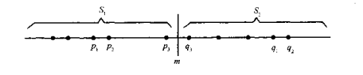
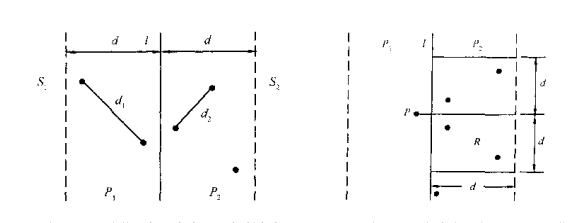
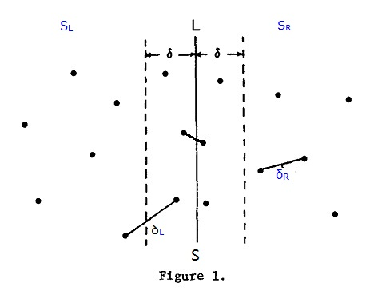
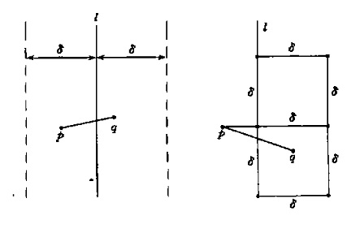

beauty_of_programming
=======================================================================================================================
1，
=======================================================================================================================

2,
=======================================================================================================================

3,一堆烙饼的排序
=======================================================================================================================
当烙饼不多的时候，我们可以很快的找出最优的翻转方案就是程序中的上界(UpperBound)，也就是说我们感兴趣的最优方案最少
也就是上面方案，那如何能找到更好的优化方案？
程序当中有个剪枝部分：
nEstimate=lowerBound(m_ReverseCakeArray,m_n)
if(step+nEstimate>m_nMaxSwap)
			return;
当m_nMaxSwap越小，剪枝条件就越容易满足,更多的情况就不用去搜索
分析：当nEstimate越大，剪枝条件就越容易满足，也就是说nEstimate越大，nMaxSwap越小，满足的条件就越小，就越容易找到最优化
解，所以在程序中必须体现尽可能减少UpperBound，增加LowerBound，从而减少要搜索的空间。
程序的上界为2*(n-1)，那么程序的下届如何估计呢：
每一次翻转，我们最多使得一个烙饼与大小相邻的烙饼排到一起。如果当前n个烙饼中，有m对相邻的烙饼半径不想了，那么我们至少需
要m次才能排好序。程序中通过遍历相邻的两个烙饼，尺寸上是否相邻来进行最小界的估计

4,买书问题（如何买书最便宜，连续买几本不同的折扣高）
=======================================================================================================================
利用动态规划解决问题，多条件递归进程处理，最后比较哪种方式的价格最低
这里把买书问题看作一个动态规划问题，状态转移方程为：
F(Y1,Y2,Y3,Y4.Y5)=0  if(Y1=Y2=Y3=Y4=Y5=0)
or F(Y1,Y2,Y3,Y4,Y5)=min{5*8*(1-25%)+F(Y1-1,Y2-1,Y3-1,Y4-1,Y5-1),
 4*8*(1-20%)+F(Y1-1,Y2-1,Y3-1,Y4-1,Y5),
 3*8*(1-10%)+F(Y1-1,Y2-1,Y3-1,Y4,Y5),
 2*8*(1-5%)+F(Y1-1,Y2-1,Y3,Y4,Y5),
 8+F(Y1-1,Y2,Y3,Y4,Y5)}

5，快速找出机器故障（找出双备份记录中仅出现一次的某个数）
=======================================================================================================================
算法核心原理：一个数和其本身的异或为0，具体情况见代码包括丢失两个记录（两个相同与两个不同）
这次代码中注释很详细，忘了的话可以看看代码

6，饮料供货（代码来自CSDN某博友ps：他的代码有点小错误）
=======================================================================================================================
在饮料总量限定的情况下，如何找到总满意度最大的一种选择，如果能列出推导公式，那么利用动态规划将很轻松就能解决

7，光影切割问题
=======================================================================================================================
光影切割部分问题能够够根据直线条数和交点数目改变成为更具比较简单的问题：
如果有N条直线，其中有M个交点，那么分块区域的数目为N+M+1
故我们只需要求N条直线M个焦点的情况，根据《编程之美》P51中图1-13所示，交点的个数就转换成了如何求一个N个元素的数组的逆序数
求逆序数时间复杂度较低的算法是采用分冶的思想，首先求N/2个元素的逆序数然后求后N/2个逆序数，最后在排序过程中合并前后两部分
的逆序数。
逆序数的求法参见这篇博文：http://blog.csdn.net/dlengong/article/details/7594919

8，电梯调度算法
=======================================================================================================================
电梯每次载满乘客后只在某一层停留，剩余的需要自己走楼梯，如何保证走楼梯的总数目最小
分析：假设有N1个乘客在i层以下，N2个乘客在i层，N3个层客在i层以上，那么假如我选择在i-1层停，那么比i层停多走的层数为N2+N3-N1
如果选择在i+1层停，那么比i层夺走的层数为N1+N2-N3。比较两者多走的大小，易知何时选择上升合适，何时选择下降合适。
代码可以从这方面着手，我们从第一层开始，得到某层以上的人数，某层所在人数，某层以上人数然后通过上述所述策略来判断是否上升
直到第一次不再上升即找到了合适的层数来保证所有人数走的层数最少。

9,高效地安排见面会
=======================================================================================================================
1，寻找可以同时召开的会议，来进一步减少花费的时间：
这个问题可以转换为图的最少着色问题：
a,将两个不能同时召开的回忆，用同一条直线进行连接
b,然后对每个顶点进行着色，保证有直线连接的两个节点不许重色

2，面试的时候，每次会面会有一个开始时间，一个结束时间，现在有一组2面试时间数据，要求每一个有冲突的时间，都不允许安排
在同一地点，求出最小需要安排的地点数目
分析:对所有面试按开始时间从小到大进行排序，然后按照顺序对各个空间着色，对当前某区间着色时，
必须保证所着的颜色没有出现在这个区域之前且时间段与当前区间有重叠的区间
一种优化算法：将所有的开始时间和结束时间共同参与艾许得到一个长度为2*N的有序数组
遍历数组，当时间类型为开始时间，则使用颜色加1，如果是结束时间，则使用颜色减1，（这里还不是弄的很明白）

10,双线程高效下载
=======================================================================================================================

11,求二进制数中1的个数
=======================================================================================================================
算法1：二进制数对2求余，如果余为0则该位上为0，为1则该位为1，然后二进制数除以2然后判断第2位直到数为0
算法2：类似于算法1但是由于求余和除以2操作相对于位操作更复杂，可以使用向右移位代替除以2，与00000001求与来判断该位是否为1
算法3：位操作相比除以和求余效率高了很多，但是时间复杂度仍为O(log2v)，那是否能够每次判断中仅与1来判断，则复杂度与1的个数有关
综上所述，我们进行v&=v-1操作，例如数为00010110&00010101=00010100，继续知道其中变为00000000，次数为其中1的个数有关。
算法4和算法5类似：都是采用空间换时间，在O(1)时间能判断出来，算法4采用分支结构，将所有分支都写出来判断，算法5采用查表法，
创建一个表，index为数，内容为1的个数，也可以在O(1)时间判断1的个数

12，不要被阶乘吓到
=======================================================================================================================
给定一个整数N，1，如何求N的阶乘N！末尾有几个0？
2，求N！的二进制表示中最低位1的位置
针对问题1，我们不可能先算法N！，因为很有可能会有溢出分析如果N！=K×10^M，且K不能被10整除，那么N！末尾有M个0，考虑对N！进行
因式分解，由于10=2×5，所以M的数目只与2和5的个数有关，M=min(X,Z)(X,Z表示因式分解中2的次数，5的次数)，易知，X肯定大于或者等于Z
故综上M=Z。
而Z的计算与11中1的个数的算法1类似。
这里我们将有另一种算法通过公式：Z=[N/5]+[N/25]+[N/5^3]...来表示N！中质因数5的个数

问题2分析即为其中含质因数2的个数同理根据公式Z=[N/2]+[N/2^2]+...既可以计算N！中质因数2的个数
另外一种算法：根据公式：N！含有质因数2的个数还等于N减去N的二进制中1的个数

13,寻找水王
========================================================================================================================
如何快速有效地在找出消息列表中发帖超过一半的那个ID？
一开始想到的办法无非是对列表进行排序，然后统计次数或者寻找第N/2个ID即为超过一半的，但是这两种办法都需要先对ID列表进行排序
有没有不进行排序的算法呢？
我们可以这样，每次删除两个不同的ID，很显然剩下的ID列表中，“水王”ID出现的次数仍然超过总数的一半，一直重复这个过程，把ID列表
内的总数降低即可以转换为更小的问题，从而得到答案

14，查找1到N中1出现的次数
=========================================================================================================================
算法描述：每一位上出现1的情况分为三类：1，该位数字为0，该位上出现1的次数由更高为决定，例如12013中百位出现1的情况为12×100=1200
2，该位数字为1不仅受高位影响还受低位影响例如12113中百位出现1的情况数目是12×100=1200，还包括12100-12113一种114个即113+1
3，如果该位上数字大于1，那么百位上可能出现1的次数由更高位决定为：（12+1）×100

15,寻找最大的k个数
=========================================================================================================================
算法1：使用快速排序或者堆排序，他们的时间复杂度都是O(N*log2N)，然后取出前K个，总时间复杂度为O(N*log2N)+O(K)=O(N*log2N)，另外
也可使用部分排序，例如选择排序，交换排序只需要把N个数中前K个数排序出来，复杂度是O(N*K)，哪一个更好，取决于K与log2N的比较。
算法2：和快速排序类似，在快速排序中，每一步都是将待排序数组分为两组，其中一组数据的人任何一个数都比另一组的任意数达，再对两组
分别做类似操作：假设N个数存储在数组S中，从数组S中随机找出一个元素X，把数组分为Sa和Sb。Sa中的元素大于等于X，Sb中的元素小于X。
故存在两个可能：a,Sa中元素的个数小于K，Sa中所有的数和Sb中最大的K-|Sa|个元素就是数组S中最大的K个数；b，Sa中元素的个数大于或等于K
，则需要返回Sa中最大的K个元素。
算法3：寻找N个数中最大的K个数，本质上就是寻找最大的K个数中最小的那个，也就是第K大的数。这里可以使用二分搜索的策略。对于一个给定的
数p，可以在O(N)的时间复杂度内找出所有不小于p的数。
算法4：上面三个算法虽然能够解决，时间复杂度增加也很正常，但是个哦南通的地方是需要对数据进行对此访问，但N足够大的时候，比如100e？
这个时候数据不能完全的装入内存，为了解决这方面的问题，可以使用最小堆的方法，最小堆容量为K，最小堆的堆顶元素就是这K个元素中最小的，
遍历N个数据，如果X比堆顶小，那么替换堆顶元素，然后更新堆来维持堆的性质，更新的过程的时间复杂度为O(log2K)。(要看书再次深刻地了解
最大堆和最小堆的关系，以及如何实现)
算法5：如果所有N个数都是正整数，且他们的取值范围不大，可以考虑申请空间，记录每个整数出现的次数，然后从大到小去最大的K个。比如所有
整数都在(0,MAXN）区间中的话，利用一个数组count[MAXN]来记录每个整数出现的个数(count[i]表示整数i在所有整数中出现的个数)。我们只需要
扫描一遍就可以得到count数组，然后找到第K大的元素。

16,最大公约数问题(大整数下)
=========================================================================================================================
算法一：采用辗转相除法，f(x,y)表示x,y的最大公约数，而最大公约数的性质有f(x,y)=f(y,x%y)，那么可以迭代直到x,y中某一数为0，即可以描述出最大的公约数。
算法二：因为算法一用到了求余运算，而对于大整数而言求余运算很复杂，有没有更简单的方法呢？
答案是明显的，我们发现f(x,y)=f(x-y,y),那么我们可以将大整数变为简单很多的减法来得到最大公约数。

算法三：算法一问题在于大整数除法计算很复杂，算法虽然将除法运算换成减法，但是减法的地带次数会增加很多，能否结合算法一和算法二从而得到一个最佳的算法呢？对于y和x来书，如果y=k*y1,x=k*x1那么f(y,x)=k*f(y,x)，如果x=p*x1假设p为素数，并且y%p!=0那么f(x,y)=f(p*x1,y)=f(x1,y)，最简单的方法：2是一个素数，并且大整数的除法和乘法运算可以换成左移和右移一位，故我们可以取p=2：
若x,y为偶数，f(x,y)=2*f(x>>1,y>>1)
x为偶数，y为奇数,则f(x,y)=f(x>>1,y)
x为奇数，y为偶数，则f(x,y)=f(x,y>>1)
x,y均为奇数，则f(x,y)=f(x,x-y)

17,斐波那契数列
==========================================================================================================================
f(n)=0 if n=0;1 if n=1; f(n-1)+f(n-2) if n>1
1,递归使用，但是系统函数调用是有限制的，不能无限递归，并且每次计算都要计算之前已经好了的数据
2，利用一个数组来存储已经计算好的数据，然后新的根据之前的两个数进行计算，这是一种递推关系式的优化
3，求通项公式，利用数学球解出f(n)的表达式，f(n)=？？？然后代入n，即可在O(1)情况下得到f(n)
4,(fn,fn-1)=(fn-1,fn-2)*A=(f1,f0)*A^n-1，其中A=[1,1;1,0]即转换为矩阵的计算而矩阵的计算可以很快的通过
分冶法计算A^n=(A^(n/2))^2,n为偶数，当为奇数时，A^n=A*(A^(n/2))^2.

18,寻找最近点对
==========================================================================================================================
算法1：数组中总共有N个数，计算其中两两之间的差值，那么就很容易计算出其中的最小值。
算法2：先对数据进行排序，如使用快排，则时间复杂度为O(Nlog2N)，然后从排好序的数据中找最小值，则只需要找相邻之间的差值即可。
但是这个算法不能推广到二维，因为距离最近的点，不能保证映射到某条直线之后紧靠着的两个点。
算法3：能够以复杂度为O(Nlog2N)解决一维和二维情况，但是算法有点小复杂还在消化中。采用的是分冶法：
为了使问题变得简单，首先考虑一维的情形，假设我们用m点将S分为S1和S2两个集合，对于所有的p(S1中的点)和q(S2中的点)，存在p<q。假设:
				d=min{|p1-p2|,|q1-q2|}

由此，S中最接近的点对或者是点对{p1,p2}和{q1,q2}或者是某个{p3,q3}
   

如果最接近点对是{q3,p3}即|p3-q3|<d，则p3和q3或者与m的距离都不超过d，且在区间(m-d,d]和(d,m+d]各自有且仅有一个点。这样，就可以在线性时间内实现合并。

在二维情形下，类似的，利用分冶法，但是难点在于如何实现线性的合并？
  
由上图可知，形成的宽为2d的带状区间，最多可能有n个点，合并时间最坏情况下为n^2。但是P1和P2中的点具有以下稀疏的性质，对于P1中任意一点，P2中的点必定落在一个d*2d的矩形中，且最多只需检查六个点（鸽巢原理）。
先将带状区间的点按y坐标排序，然后线性扫描这样合并的时间复杂度为O(nlogn)，几乎为线性。
具体步骤如下：已知集合S中有n个点，分治法的思想就是将S进行拆分，分为2部分求最近点对。算法每次选择一条垂线L，将S拆分左右两部分为SL和SR，L一般取点集S中所有点的中间点的x坐标来划分，这样可以保证SL和SR中的点数目各为n/2，（否则以其他方式划分S，有可能导致SL和SR中点数目一个为1，一个为n-1，不利于算法效率，要尽量保持树的平衡性）

依次找出这两部分中的最小点对距离：δL和δR，记SL和SR中最小点对距离δ = min（δL，δR），如下图：
   
以L为中心，δ为半径划分一个长带，最小点对还有可能存在于SL和SR的交界处，如下图2左图中的虚线带，p点和q点分别位于SL和SR的虚线范围内，在这个范围内，p点和q点之间的距离才会小于δ，最小点对计算才有意义。
  
对于SL虚框范围内的p点，在SR虚框中与p点距离小于δ的顶多只有六个点，就是图二右图中的2个正方形的6的顶点。这个可以反推证明，如果右边这2个正方形内有7个点与p点距离小于δ，例如q点，则q点与下面正方形的四个顶点距离小于δ，则和δ为SL（）和SR中的最小点对距离相矛盾。因此对于SL虚框中的p点，不需求出p点和右边虚线框内所有点距离，只需计算SR中与p点y坐标距离最近的6个点，就可以求出最近点对，节省了比较次数。
**这里还是有点不是特别理解，不强求了，之后复习再看吧**

19,快速寻找数据中两数和为某一定值的数对
=================================================================================================================================
解法一:穷举法，从数组中任意取出两个数字，计算两者之和是否为给定的数字。时间复杂度为O(N2)
解法二：对应数组中每个数字arr[i]判断Sum-arr[i]是否在数组中，这样就变通为一个查找算法。提高查找效率的方法通常是先将要查找的数组排序，然后用二分查找等方法进行查找，总的时间复杂度为O(Nlog2N)。查找方法的一种空间换时间的算法为使用hash表存储，这样能够使用常数时间查找数字，总的时间复杂度变为O(N)但是这种方法需要额外增加O(N)的hash存储空间。
解法三：假设有了这个数组的任意两个元素之和的有序数组(长为N2).那么利用二分查找法，只需要O(2log2N)就可以解决这个问题，受这个思考启发，我们可以直接对两个数字的和进行一个有序的遍历，从而降低算法的时间复杂度。
首先，对数组进行排序，时间复杂度为Nlog2N，然后令i=0,j=n-1，看arr[i]+arr[j]是否等于Sum，如果是，则结束。如果小于Sum，则i=i+1；如果大于Sum，则j=j-1.这样只需要在排好序的数组上遍历一次，就可以得到最后的结果，时间复杂度为O(N)，那么两部加上来的总的时间复杂度为O(Nlog2N)

20，求子数组中最大乘积（给定长度为N的整数数组，计算任意(N-1)个数的组合中乘积最大的一组）
=================================================================================================================================
解法一：计算(N-1)个数的组合乘积，假设第i个(0<=i<=N-1)元素排除在乘积之外，设array[]为初始数组，s[i]表示数组前i个元素的乘积，t[i]表示数组后(N-i)个元素的成绩，那么设p[i]为数组除第i个元素外，其他N-1个元素的成绩既有p[i]=s[i-1]*t[i+1]，故知需要从头到尾，和从尾至头两次即可得到数组s[]和t[]，进而可以先行时间得到p[]，总的时间复杂度为O(N)。
解法二：通过数学分析，还可以进一步减少问题的计算量。假设N个整数的乘积为P，则分为3种情况：

1. **P为0，那么数组中至少包含有一个0.假设除掉一个0之外，其他N-1个数的乘积为Q，则根据Q的政府性进行讨论：**
	* Q=0,那么说明数组中至少有两个0，那么N-1个数的乘积只能为0，返回0；
	* Q>0，返回Q，因为如果以0代替此时N-1个数中任意一个其他的数，那么N-1个数乘积为0.
	* Q<0,返回0，因为如果此时0代替N-1个数任意一个其他的数，那么N-1个数乘积为0
2. **P<0，则遍历去掉绝对值最小的负数。**
3. **P>0,则去掉最小的正数值，当数组中没有正数时，去掉绝对值最大的负数值。**

21,求数组的子数组之和的最大值
=================================================================================================================================
首先，我们明确题意：1，题目说的子数组是连续的；2，题目只需要求和，并不需要返回子数组的具体位置；3，数组的元素是整数，所以数组可能包含有正整数、零、负整数。
解法一，暴力法:记Sum[i,...,j]，然后两次遍历数组元素，遍历所有可能的Sum[i,...,j]即可，时间复杂度大概为O(N^3)但是经过一些优化可能达到O(N^2)
解法二，使用递归方法，如果将所给数组(A[0],...,A[n-1])分为长度相等的两部分(A[0],...,A[n/2-1])和(A[n/2],...,A[n-1])，分别求出这两段数组各自的最大字段和，则可能最大子段和有以下3种情况的最大值：

1. (A[0],...,A[n-1])的最大子段和与(A[0],..,A[n/2-1])的最大子段和相同；
2. (A[0],...,A[n-1])的最大子段和与(A[n/2],...,A[n-1])的最大子段和相同；
3. (A[0],...,A[n-1])的最大子段和跨过其中间两个元素A[n/2-1]到A[n/2]
若情况为1，2，那么只要找到以A[n/2-1]结尾的和最大的一段数组之和s1=(A[i],...,A[n/2-1])和以A[n/2]开始和最大的一段数组之和s2=(A[n/2],...,A[j])那么第3种情况的最大值为s1+s2=A[i]+...+A[n/2-1]+A[n/2]+...+A[j],因此只需要对原数组进行一次遍历。这是一种分冶算法，每个问题分解为规模减半的子问题，最后的时间复杂度为O(N*log2N)。

解法三，采用动态规划的方法来解决这类问题：可以将一个大问题(N个元素数组)转化为一个较小的问题(n-1个元素的数组)。股可以得到这样的递推式：
start=max{A[i],start+A[i]}
all=max{start,all},其中，start[i]表示包括A[i]的和最大的一段数组，A[i]表示(A[i],...,A[n-1])中和最大的一段数组之和。

22，子数组之和的最大值(二维)
=================================================================================================================================
算法一：枚举法，枚举每一个矩形区域，然后再求这个矩形区域的所有元素之和，求所有元素之和可以使用类似于图像中积分图的概念，可以在O(1)的复杂度内得到指定矩形的元素之和。这样，算法一的时间复杂度为O(N^2×M^2)
算法二：遍历矩形时，只遍历行数，然后将指定行数的所有元素排成一维，那么就可以使用上面的算法三，动态规划算法来解决，那么时间复杂度则为O(N^2*M)。

23，求数组中最长递增子序列
=================================================================================================================================
算法一：根据无后性的特征，使用动态规划来解决例如：1，-1，2，-3，4，-5，6，-7
当i=1时，显然，最长的递增序列为(1)，序列长度为1.
当i=2时，由于-1<1.因此，必须丢弃第一个值然后重新建立串。当前的递增序列为(-1)，长度为1.
当i=3时，由于2>1，2>-1.因此，最长的递增序列为(1,2),(-1,2),长度为2，2前面是1还是-1对求出后面的递增序列没有直接影响
故以此类推，可有以下结论：
lis[i+1]=max{1,lis[k]+1},array[i+1]>array[k], for any k <=i,即如果array[i+1]大于array[k]，那么第i+1个元素可以接在lis[k]长的子序列后面构成一个更长的子序列。or，array[i+1]本身作为下一个子序列的开头
算法二，利用排序和最长公共子序列的算法来解决这个问题，递增子序列一定是排序之后的数组，与原数组的最长公共子序列(LCS)，在后面设计到LCS的时候，在做这的第二种方法
算法三，假设存在一个序列 d[1..9] = 2 1 5 3 6 4 8 9 7，可以看出来它的 LIS 长度为 5。

下面一步一步试着找出它。
我们定义一个序列 B，然后令 i = 1 to 9 逐个考察这个序列。
此外，我们用一个变量 Len 来记录现在最长算到多少了:

1.	首先，把 d[1]有序地放到 B 里，令 B[1] = 2，就是说当只有 1 一个数字 2 的时候，长度为 1 的 LIS 的最小末尾是 2。这时 Len=1
2.	然后，把 d[2]有序地放到 B 里，令 B[1] = 1，就是说长度为 1 的 LIS 的最小末尾是 1，d[1]=2 已经没用了，很容易理解吧。这时 Len=1
3.	接着，d[3] = 5，d[3]>B[1]，所以令 B[1+1]=B[2]=d[3]=5，就是说长度为 2 的 LIS 的最小末尾是 5，很容易理解吧。这时候 B[1..2] = 1, 5，Len＝2
4.	再来，d[4] = 3，它正好加在 1,5 之间，放在 1 的位置显然不合适，因为 1 小于 3，长度为 1 的 LIS 最小末尾应该是1，这样很容易推知，长度为 2 的 LIS 最小末尾是 3，于是可以把 5 淘汰掉，这时候 B[1..2] = 1, 3，Len = 2
5.	继续，d[5] = 6，它在 3 后面，因为 B[2] = 3, 而 6 在 3 后面，于是很容易可以推知 B[3] = 6, 这时 B[1..3] = 1, 3, 6，还是很容易理解吧？ Len = 3 了噢。
6.	第 6 个, d[6] = 4，你看它在 3 和 6 之间，于是我们就可以把 6 替换掉，得到 B[3] = 4。B[1..3] = 1, 3, 4， Len 继续等于 3
7.	第 7 个, d[7] = 8，它很大，比 4 大，嗯。于是 B[4] = 8。Len 变成 4 了
8.	第 8 个, d[8] = 9，得到 B[5] = 9，嗯。Len 继续增大，到 5 了。
9.	最后一个, d[9] = 7，它在 B[3] = 4 和 B[4] = 8 之间，所以我们知道，最新的 B[4] =7，B[1..5] = 1, 3, 4, 7, 9，Len = 5。
于是我们知道了 LIS 的长度为 5。
**我们会发现一件事情，在B中插入数据是有序的，只会替换不会移动，因而我们可以使用二分查找来将每一个数据的插入时间复杂度减小为O(logN),于是算法的复杂度为O(NlogN).**

24，数组循环移位(要求时间复杂度为O(N))
=================================================================================================================================
算法一：试验简单的办法，每次将数组中的元素右移一位，循环K次，可以实现数组的循环右移，但是算法复杂度为O(K*N),不符合要求
算法二：可能以看到这个问题就可能会产生K<N的错觉，但是严格来说不能使用这样的惯性思维，K可能是一个远大于N的整数。而当K远大于N时，其实右移K位的情形和右移K'=K%N位置后的情形一样。因此当K>>N的情况时，时间复杂度变为O(N^2)。相对算法一自然复杂度降低了，但是远远不够
算法三：假设原数组序列为abcd1234,要求循环右移4位，即变换成数组序列为1234abcd，可通过以下步骤完成：

1.	逆序排列abcd：abcd1234-->dcba1234
2.	逆序排列1234: dcba1234-->dcba4321
3.	全部逆序：dcba4321-->1234abcd
即可得到循环右移4位后的数组。时间复杂度为O(N)

25，数组分割
=================================================================================================================================
这个问题个人在《编程之美》上面没有太看懂，在csdn找到了一篇博客，做成了pdf文档放在这里，可以去看看 [数组分割](./PDF/数组分割.pdf "数组分割.pdf")

26，区间重合判断
=================================================================================================================================
算法一：一个比较直接的思路即将源区间[x,y](y>=x)和N个无序的目标区间[x1,y1][x2,y2][x3,y3]...[xn,yn]逐个投影到坐标轴上，只考察源区间中未被覆盖的部分。如[1,6]和[2,3][1,2][3,9]，将源区间画在坐标轴上，然后在依次遍历目标区间，进行位置覆盖，目标区间遍历完成后，观察是否源区间完全被覆盖，如果是则表示给定源区间在无序的目标区间内。
算法二：对无序的目标区间进行预处理，按X轴进行从小到大的排序(排序时可以使用快排)，如[2,3][1,2][3,9]-->[1,2][2,3][3,9]；接着扫描排序后的目标区间，将这些区间合并成**若干个互不相交**的区间[1,9];然后在数据初始化的基础上，运用二分查找来判定源区间[x,y]是否被合并后的这些互不相交的区间中的某一个包含。，若被包含则说明源区间在无序的若个目标区间内。

27,字符串移位包含的问题
=================================================================================================================================
算法一，常规，对原字符串s1进行循环移位，再进行字符串包含的判断，从而遍历所有的可能性。
算法二，分析循环移位的结果：以s1=ABCD为例，先分析对s1进行循环移位之后的结果，如下：
			ABCD->BCDA->CDAB->DABC->ABCD
假设我们抱前面移走的数组进行保留，会发现有以下的规律：
			ABCD->ABCDA->ABCDAB->ABCDABC->ABCDABCD
因此可以看出s1做循环移位的所得到的字符串都将是字符串s1s1的子字符串。如果s2可以由s1循环移位得到，那么s2一定在s1s1上，则我们可以将问题转换为一次考察s2是否在s1s1上，调用一次strstr函数即可得到结果。

28，电话号码对应英语单词
=================================================================================================================================
这个问题，编程之美上面主要是讲的是将一个多重循环(与电话号码位数一直)的转换为一个2重循环的写法以及对应的递归算法的实现，总结的并不完整，本人搜索了博客之后，发现网友有很多相关的总结很有效，包括直接遍历(实质多叉树的遍历(前中后序))。 已经制作了一个pdf文档: [电话号码对应英语单词](./PDF/电话号码对应英语单词.pdf "电话号码对应英语单词.pdf")

29,计算字符串的相似度
=================================================================================================================================
判断字符串A和字符串B的相似度，这个题目很适合递归方法解决，函数包括以下几个部分：

1.	pA为NULL时，如果pB也为NULL，那么此时pA与pB相似度为0。（递归终止条件）
2.	pA为NULL时，pB不为NULL，那么此时相似度为pBEnd-pBBegin+1（递归终止条件）
3.	PB为NULL时情况，也同1，2（递归终止条件）
4.	递归过程分为2类：

	*	两字符串第一个字符相等，那么相似度就为除去第一个字符之外的字符串的相似度
	*	两字符串不相等(删除A、删除B、修改)，那么相似度为除去对应第一个字符（删除时除去对应字符、修改除去两字符串字符）的字符串的相似度+1
这个递归过程很明朗，但是分析发现其中有计算重复的部分，可以使用数组存储子问题的结果，然后每次递归之前查下子问题结果是否已经计算出来，如果已计算则不需要计算，直接取出结果。

30,从无头单链表中删除节点
=================================================================================================================================
在一般单链表（有头节点）的删除节点操作时，比如删除pCurrent，我们需要遍历到pCurrent的上一个节点pPrev,然后进行操作pPrev->next=pCurrent->next。但是没有头节点时，我们无法遍历到pCurrent的上一个节点，怎么办呢？其实我们可以不管pPrev，但是我们可以知道pCurrent的下一个节点pNext，这样我们可以删除其中pNext节点，pCurrent->next=pNext->next，然后将data域复制即可：pCurrent->data=pNext->data。使用这种狸猫换太子的方法可以保证在不知道删除节点的上一节点时人可以达到相同结构